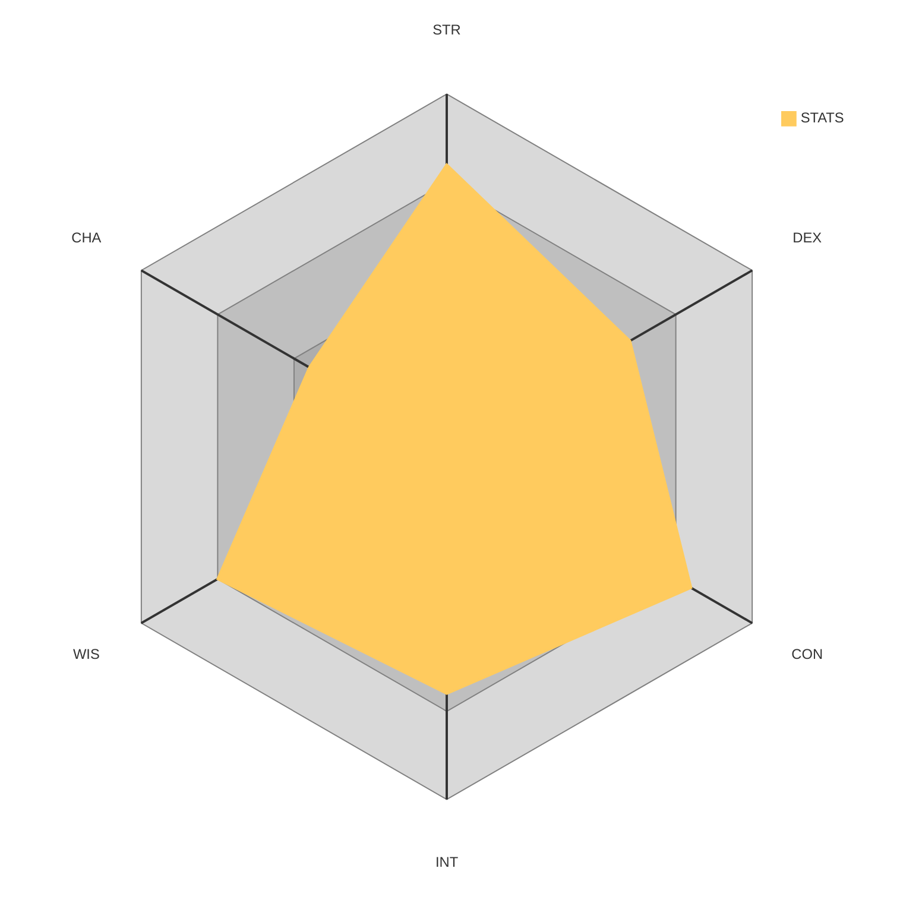

<div align="center">



</div>

---

<div align="center">
<ScrambleText>Two Column Layout in Markdown!</ScrambleText>
</div>
---

<Flex direction="row">

```ts title="Hurray JSX in MDX"
const isWorking: boolean = true!;

⠀⠀⠀⠀⠀⠀⠀⠀⠀⠀⠀⠀⠀⠀⠀⠀⠀⠀⠀⠀⠀⠀⢠⣤⣶⣶⣶⣦⡄⠀⠀⠀⠀⠀⠀⠀⠀⠀⠀⠀⠀
⠀⠀⠀⠀⠀⠀⠀⠀⠀⠀⠀⠀⠀⠀⠀⠀⠀⠀⣀⣠⣤⣴⣾⣿⣿⣿⣿⣿⣿⣿⣷⡄⠀⠀⠀⠀⠀⠀⠀⠀⠀⠀
⠀⠀⠀⠀⠀⠀⠀⠀⠀⠀⠀⠀⠀⢀⣤⣶⣾⣿⣿⣿⣿⣿⣿⣿⣿⣿⣿⣿⣿⣿⣿⣿⠀⠀⠀⠀⠀⠀⠀⠀⠀⠀
⠀⠀⠀⠀⠀⠀⠀⠀⠀⠀⠐⢶⣾⣿⣿⣿⣿⣿⣿⣿⣿⣿⣿⣿⣿⣿⣿⠿⠛⠛⠻⢏⠀⠀⠀⠀⠀⠀⠀⠀⠀⠀
⠀⠀⠀⠀⠀⠀⠀⠀⠀⢀⣴⣿⣿⣿⣿⣿⣿⣿⣿⣿⣿⣿⢟⣿⠟⠅⠉⠀⠀⠀⠀⠀⢣⠀⠀⠀⠀⠀⠀⠀⠀⠀
⠀⠀⠀⠀⠀⠀⠀⠀⠀⣀⣴⣿⣿⣿⣿⣿⣿⣿⣿⣟⣿⣗⡕⡅⡅⡅⣭⠀⠀⠀⠀⠀⠀⡇⠀⠀⠀⠀⠀⠀⠀⠀
⠀⠀⠀⠀⠀⠀⠀⠀⠀⢙⣿⣿⣿⣿⣿⣿⣿⡻⡪⡪⡫⡊⡂⠂⡂⠂⠀⠀⠀⠀⠀⠀⠀⠣⡀⠀⠀⠀⠀⠀⠀⠀
⠀⠀⠀⠀⠀⠀⠀⠀⠐⢻⣟⣿⣟⣗⣟⢿⡪⡪⡪⡊⡂⡂⡂⠂⠀⠀⠀⠀⠀⠀⠀⣀⣤⣤⣵⠀⠀⠀⠀⠀⠀⠀
⠀⠀⠀⠀⠀⠀⠀⠀⠀⠀⢟⣗⣗⢗⢕⢽⡪⡊⣂⣢⣦⣦⣤⣤⣤⣤⣤⣤⣤⣤⣬⣥⣤⣶⢷⡄⠀⠀⠀⠀⠀⠀
⠀⠀⠀⠀⠀⠀⠀⠀⠀⠀⠘⣗⢕⢕⢕⢙⣢⢪⠒⡢⢍⠂⠹⣝⡍⠉⠉⠉⠉⠉⠉⠉⠉⣿⢸⠀⠀⠀⠀⠀⠀⠀
⠀⠀⠀⠀⠀⠀⠀⠀⠀⠀⠀⣗⢕⢑⠐⠐⢺⠀⡎⠤⣊⡆⠀⣿⣇⠀⠀⠀⠀⠀⠀⠀⠀⠛⠊⢢⠀⠀⠀⠀⠀⠀
⠀⠀⠀⠀⠀⠀⠀⠀⠀⠀⠀⢫⠨⠨⠠⠀⠈⢇⠰⣰⣿⡀⣠⣿⣿⡀⠀⠀⠀⠀⠀⠀⠀⢀⡠⠜⠀⠀⠀⠀⠀⠀
⠀⠀⠀⠀⠀⠀⢀⣤⣶⣶⣶⡏⠨⠈⠀⠀⠀⠈⠢⢄⡉⣱⣿⣿⣿⣿⣿⣶⣦⣄⠀⠀⣰⣿⢟⠀⠀⠀⠀⠀⠀⠀
⠀⠀⠀⠀⢠⣶⣿⣿⣿⣿⡿⠀⠀⠀⠀⠀⠀⠀⠀⢤⣾⣿⣿⣿⣿⣿⣿⣿⣿⣿⣷⣶⣿⠳⡉⠀⠀⠀⠀⠀⠀⠀
⠀⠀⠀⢀⣾⣿⣿⣿⣿⢿⠁⠀⠀⠀⠀⠀⠀⠀⠀⢲⣾⣿⣿⣿⣿⣿⣿⣿⣿⣿⣿⣿⣿⣷⡅⠀⠀⠀⠀⠀⠀⠀
⣠⣤⣶⣿⣿⣿⣿⣿⣧⠀⣵⡀⠀⠀⠀⠀⠀⠀⠀⠀⠙⠿⣿⣿⣿⣿⣿⣿⣿⣿⣿⣿⣿⣿⣿⠀⠀⠀⠀⠀⠀⠀
⣿⣿⣿⣿⣿⣿⣿⣿⣿⡀⣀⠈⣆⠀⠀⠀⠀⠀⠀⠀⠀⠛⠿⣿⣿⣿⣿⣿⣿⣿⣿⣿⣿⡿⠃⠀⠀⠀⠀⠀⠀⠀
⣿⣿⣿⣿⣿⣿⣿⣿⣿⣷⣉⠀⣉⠑⣄⠀⠀⠀⠀⠀⠀⠀⠀⠀⢠⡊⠉⣻⣿⣿⣿⡅⠀⠀⠀⠀⠀⠀⠀⠀⠀⠀
⣿⣿⣿⣿⣿⣿⣿⣿⣿⣿⣯⠀⣉⠀⣉⠉⢢⡀⠀⠀⠀⠀⠀⢠⣿⣧⡀⣉⠘⣿⣿⣿⣦⣀

```

<Flex p="8" direction="column" flexGrow="1" width="50%">

## Brandolini's Law

<Quote size="8">
The amount of energy needed to refute bullshit is an order of magnitude bigger than that needed to produce it. — Alberto Brandolini
</Quote>

</Flex>

</Flex>

---

## An example H2

A bullet list

- Content lives in `./vault/`.
- `bun run generate` converts it into MDX under `./content/` and assets into `./public/`.
- Rendered by **Fumadocs Core** + **React Router** as a static SPA on **Bun**.
- Wrapped in **Radix Themes**.

---
