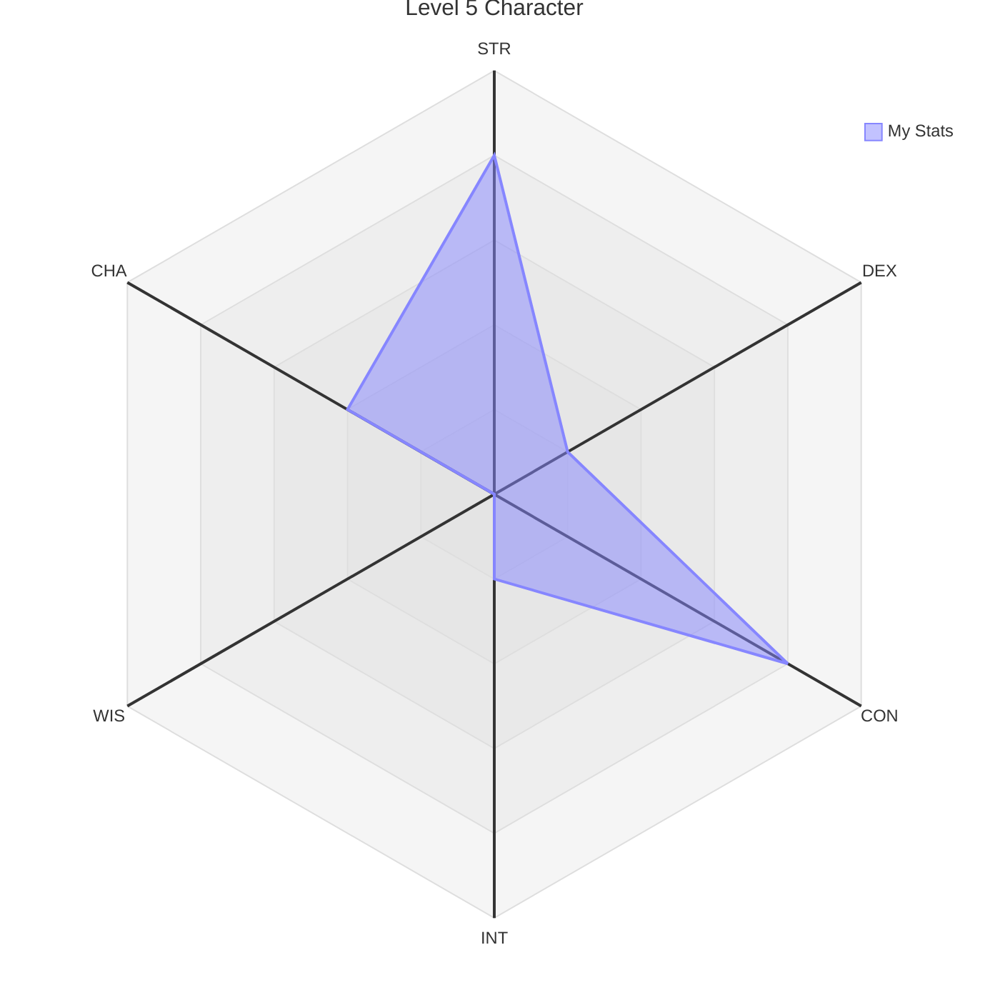

<ScrambleText>nicholaswagner.dev</ScrambleText>

![[me.png]]

This is a landing page generated from `vault/index.md`.

---

## An example H2

A bullet list

- Content lives in `./vault/`.
- `bun run generate` converts it into MDX under `./content/` and assets into `./public/`.
- Rendered by **Fumadocs Core** + **React Router** as a static SPA on **Bun**.
- Shelled in **Radix Themes**.

---



---

## Other things and stuff

<mark> Highlighted text </mark>

> [!quote] A Quote
> "Success is not final, failure is not fatal: it is the courage to continue that counts."

---

<Callout type="success">A success callout!</Callout>
<Callout type="info">An info callout!</Callout>
<Callout type="warn">A warning callout!</Callout>
<Callout type="error">An error callout!</Callout>

<Callout type="todo"><ScrambleText>A Combined Callout!</ScrambleText></Callout>

```ts
export function getMDXComponents(extra?: MDXComponents): MDXComponents {
  return {
    h1: (p) => <Heading as="h1" size="8" mt="6" mb="3" {...p} />,
    h2: (p) => <Heading as="h2" size="6" mt="6" mb="2" {...p} />,
    h3: (p) => <Heading as="h3" size="5" mt="5" mb="2" {...p} />,
    h4: (p) => <Heading as="h4" size="4" mt="4" mb="2" {...p} />,
    h5: (p) => <Heading as="h5" size="3" mt="4" mb="1" {...p} />,
    h6: (p) => <Heading as="h6" size="2" mt="4" mb="1" {...p} />,
    p: (p) => <Text as="p" size="3" mb="3" {...p} />,
    a: Anchor,
    strong: (p) => <Text weight="bold" {...p} />,
    em: (p) => <Text style={{ fontStyle: 'italic' }} {...p} />,
    // code: (p) => <Code variant="ghost" weight="light" {...p} />,
    code: (p) => buildCode(p),
    pre: (p) => (
      <pre
        {...p}
        style={{
          background: 'var(--gray-2)',
          border: '1px solid var(--gray-5)',
          borderRadius: 'var(--radius-3)',
          padding: '1rem',
          overflowX: 'auto',
          margin: '1rem 0',
          ...p.style,
        }}
      />
    ),
    kbd: (p) => <Kbd {...p} />,
    hr: () => <Separator size="4" my="5" />,
    blockquote: (p) => <Blockquote {...p} />,
    ul: (p) => (
      <Text as="div" size="3" mb="3" asChild>
        <ul style={{ paddingLeft: '1.5rem', listStyleType: 'disc' }} {...p} />
      </Text>
    ),
    ol: (p) => (
      <Text as="div" size="3" mb="3" asChild>
        <ol style={{ paddingLeft: '1.5rem', listStyleType: 'decimal' }} {...p} />
      </Text>
    ),
    li: (p) => <li style={{ marginBottom: '0.25rem' }} {...p} />,
    table: (p) => <Table.Root variant="surface" my="4" {...p} />,
    thead: (p) => <Table.Header {...p} />,
    tbody: (p) => <Table.Body {...p} />,
    tr: (p) => <Table.Row {...p} />,
    th: (p) => <Table.ColumnHeaderCell {...p} />,
    td: (p) => <Table.Cell {...p} />,
    img: (p) => (
      <span className="image-container"></span>
    ),
    Callout: buildCallout,
    ObsidianCallout: buildObsidianCallout,
    ObsidianCalloutTitle: buildObsidianCalloutTitle,
    ObsidianCalloutBody: buildObsidianCalloutBody,

    // Custom components reachable from vault `.md` as bare JSX, e.g.
    // `<ScrambleText>headline</ScrambleText>`. PascalCase is required for
    // the MDX parser to treat them as components rather than HTML tags.
    ScrambleText,
    ...extra,
  };
}
```

```bash
.
├── app
│   ├── components
│   │   ├── hooks
│   │   │   └── useScrambleText.ts
│   │   ├── Sidebar.tsx
│   │   ├── TOC.tsx
│   │   └── ui
│   │       ├── NW.tsx
│   │       ├── scrambleText.tsx
│   │       ├── site-nav.tsx
│   │       ├── theme-toggle
│   │       │   ├── styles.module.css
│   │       │   └── ThemeToggle.tsx
│   │       └── ThemeContext.tsx
│   ├── layouts
│   │   ├── DocsShell.tsx
│   │   └── LandingShell.tsx
│   ├── lib
│   │   ├── mdx-callout-builders.tsx
│   │   ├── mdx-components.tsx
│   │   └── source.ts
│   ├── root.tsx
│   ├── routes
│   │   ├── _index.tsx
│   │   └── $.tsx
│   ├── routes.ts
│   ├── styles
│   │   └── global.css
│   └── utils
│       └── debounce.ts
├── bun.lock
├── bunfig.toml
├── Fumadocs.md
├── ICEBOX.md
├── package.json
├── public
├── react-router.config.ts
├── README.md
├── scripts
│   ├── build-search-index.ts
│   └── generate.ts
├── source.config.ts
├── tsconfig.json
├── vault
│   ├── images
│   │   └── me.png
│   ├── index.md
│   └── notes
│       ├── example.md
│       └── hello.md
└── vite.config.ts

16 directories, 36 files
```
