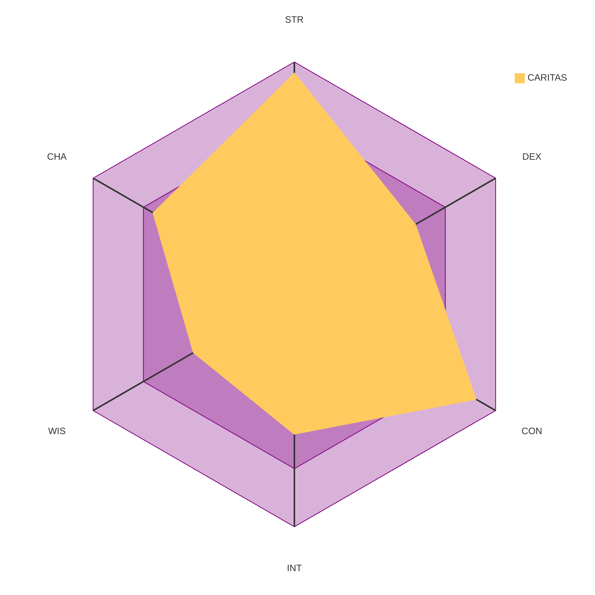

## Abilities

|   STR   |   DEX   |   CON   |   INT   |   WIS   |   CHA   |
| :-----: | :-----: | :-----: | :-----: | :-----: | :-----: |
| 19 (+4) | 12 (+1) | 18 (+4) | 12 (+1) | 10 (+0) | 14 (+2) |

## Overview

|                  |                             |
| ---------------- | --------------------------- |
| **Class**        | Fighter 5                   |
| **Ancestry**     | Human                       |
| **Heritage**     | Noble Human - House Zespire |
| **Background**   | Young Reformer              |
| **Alignment**    | Neutral                     |
| **Deity**        | Abadar                      |
| **Gender / Age** | Male, 27                    |
| **Size**         | Medium                      |
| **Key Ability**  | Strength                    |
| **Languages**    | Common, Hallit              |

## Defenses

|                |                                  |
| -------------- | -------------------------------- |
| **AC**         | **23** (7 prof + 1 dex + 5 item) |
| **HP**         | 83                               |
| **Speed**      | 25 ft                            |
| **Fortitude**  | +13 (Expert)                     |
| **Reflex**     | +10 (Expert)                     |
| **Will**       | +9 (Expert)                      |
| **Perception** | +9 (Expert)                      |

## Proficiencies

|                                        |                          |
| -------------------------------------- | ------------------------ |
| **Class DC**                           | Trained                  |
| **Simple / Martial / Unarmed**         | Expert                   |
| **Advanced**                           | Trained                  |
| **Light / Medium / Heavy / Unarmored** | Trained                  |
| **Master Weapons**                     | Dueling Sword, Longsword |

## Skills

| Skill                | Bonus | Rank    |
| -------------------- | :---: | ------- |
| Acrobatics           |  +10  | Expert  |
| Athletics            |  +13  | Expert  |
| Diplomacy            |  +11  | Expert  |
| Intimidation         |  +9   | Trained |
| Society              |  +8   | Trained |
| Thievery             |  +8   | Trained |
| Lore: Dueling        |  +10  | Expert  |
| Lore: Glorian Empire |  +8   | Trained |

## Weapons

| Weapon                                     | Attack | Damage | Type | Notes           |
| ------------------------------------------ | :----: | :----: | :--: | --------------- |
| **Provenence** (Dueling Sword +1 striking) |  +16   | 2d8+4  |  S   | _Merciful_ rune |
| **Hot Summer Knights Sword** (Longsword)   |  +15   | 1d8+4  |  S   |                 |
| Dagger                                     |  +13   | 1d4+4  |  P   |                 |
| Corset Knife                               |  +13   | 1d4+4  |  P   |                 |
| Fist                                       |  +13   | 1d4+4  |  B   |                 |

## Armor & Shield

- **+1 Raiment Chain Mail** _(worn)_
- Scale Mail _(backup)_
- Sturdy Shield (Minor)
- Parrying Scabbard

## Class Features

- Reactive Strike
- Bravery
- Sword (weapon group mastery)
- Noble Human - House Zespire

## Feats

### Level 1

- **Heritage** — Noble Human - House Zespire
- **Class** — Vicious Swing
- **Ancestry** — Natural Ambition → Sudden Charge
- **Awarded** — Shield Block, Subtle Theft

### Level 2

- **Class** — Intimidating Strike
- **Skill** — Dirty Trick
- **Archetype** — Sword Duelist Dedication
- **Awarded** — Additional Lore

### Level 3

- **General** — Assurance (Athletics)

### Level 4

- **Class** — United Assault
- **Skill** — Titan Wrestler
- **Archetype** — Sword Parry

### Level 5

- **Ancestry** — General Training → Toughness

## Equipment

### Worn / Invested

- Backpack
- Clothing (Fine)
- Parrying Scabbard
- Thieves' Toolkit
- Potency Crystal

### In Backpack

- Bedroll
- Chalk ×10
- Flint and Steel
- Rations ×2
- Torch ×5
- Waterskin
- Writing Set

## Currency

| CP  | SP  | GP  | PP  |
| :-: | :-: | :-: | :-: |
|  0  |  1  |  3  |  0  |
