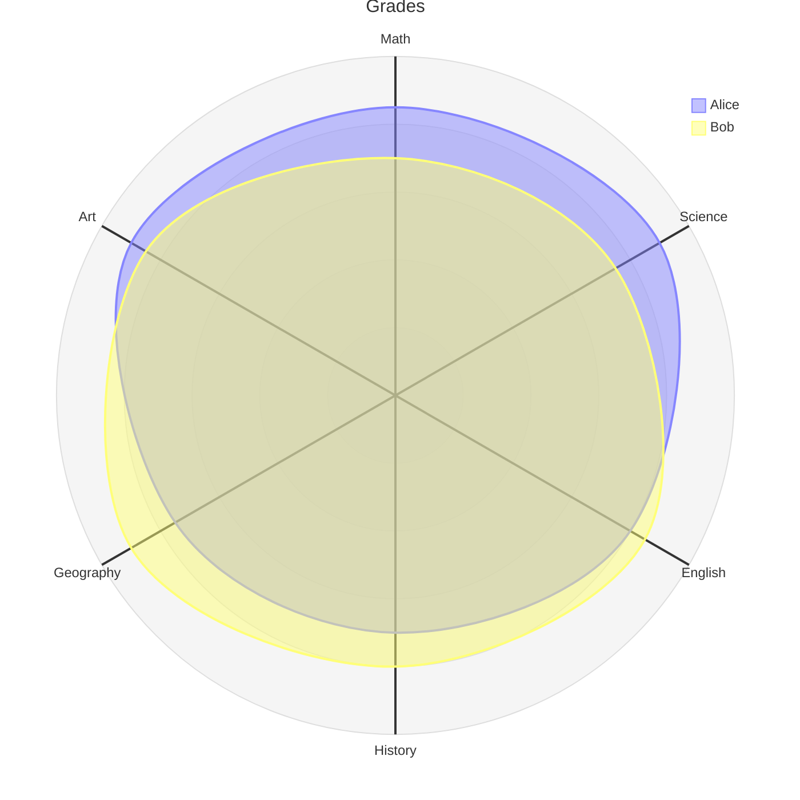
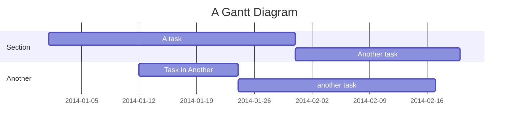
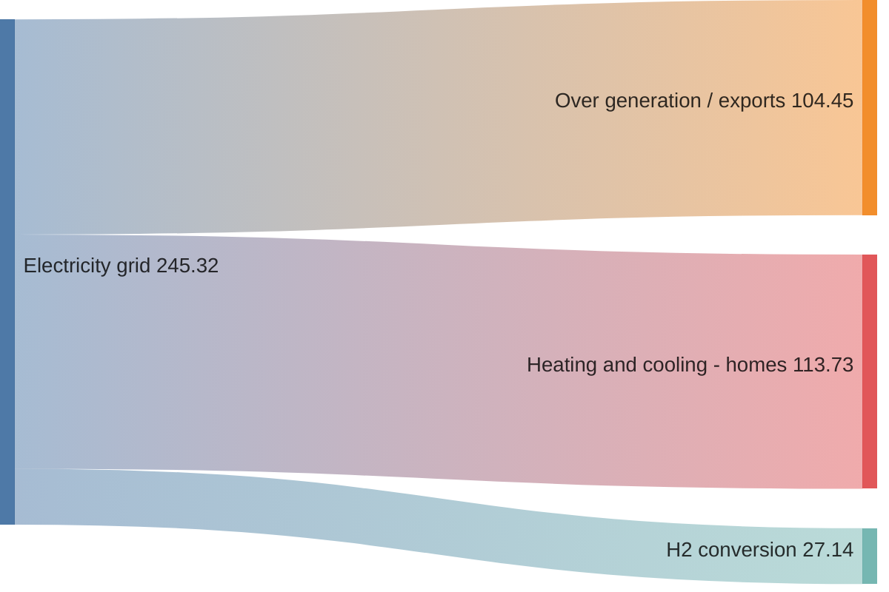
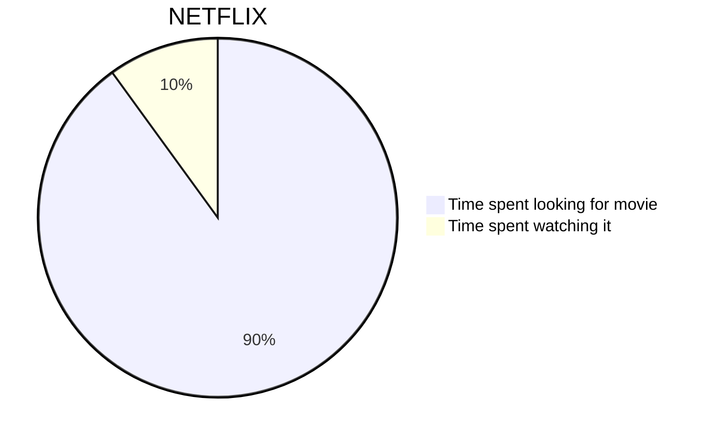
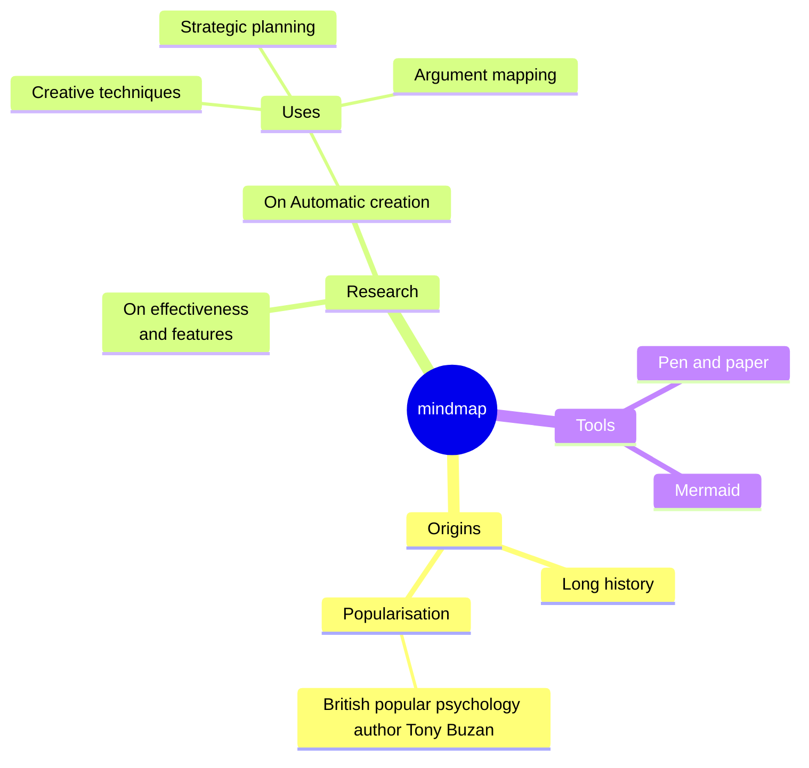
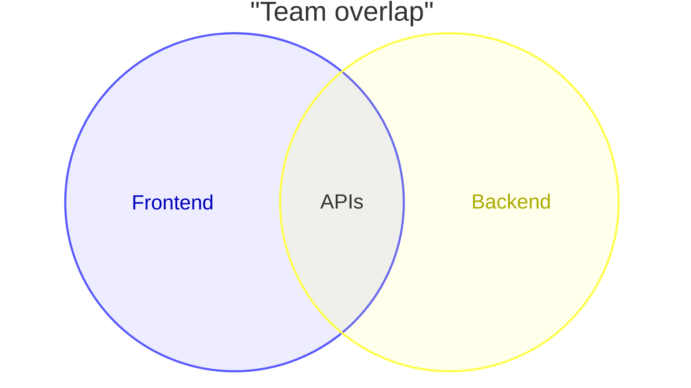
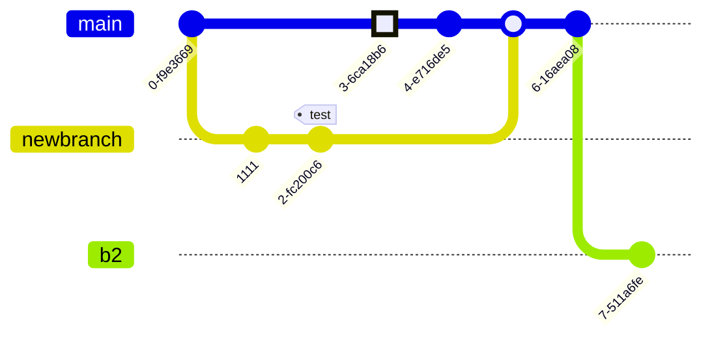

## mermaid-js examples

On the site we generate diagrams from markdown-like text using [mermaid-js](https://github.com/mermaid-js/mermaid).

## Radar

## Gantt

## Sankey

## Pie Chart

## Mind Map

## Venn

## Git Commit Flow Diagram

