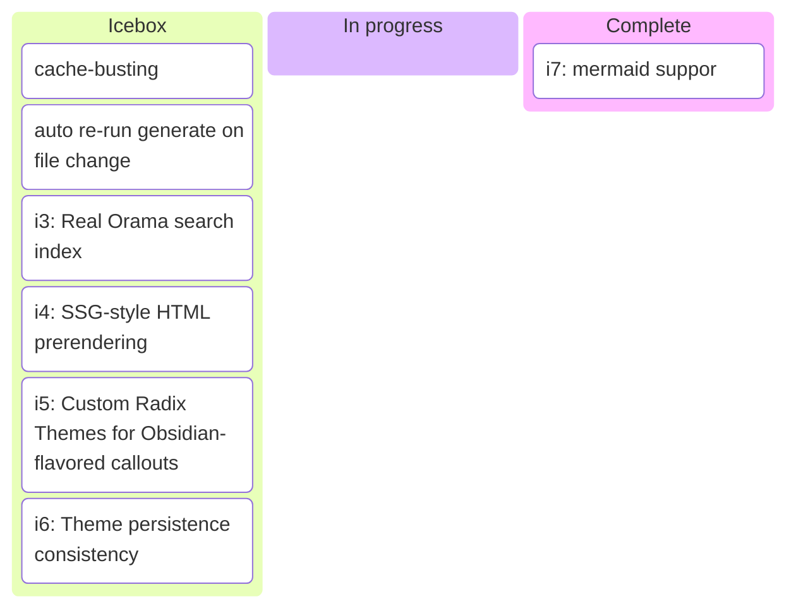

---
config:
  kanban:
    ticketBaseUrl: "https://mermaidchart.atlassian.net/browse/#TICKET#"
---

```mermaid
kanban
  Icebox
    i1: Hashed asset URLs (cache-busting)
    i2: Vault watcher (auto re-run generate on file change)
    i3: Real Orama search index
    i4: SSG-style HTML prerendering
    i5: Custom Radix Themes for Obsidian-flavored callouts
    i6: Theme persistence consistency
  In progress
  Complete
    i7: mermaid suppor
```
